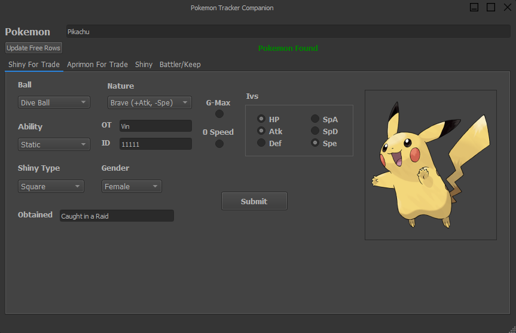

# Pokemon-Collection-Companion
An App designed to help manage a Pokemon Collection using this spreadsheet template: https://docs.google.com/spreadsheets/d/15MAGvkcC90pAVYerneWJ9qBiGqiKpnY5rez3mX7lPME/edit?usp=sharing

## Features
* Add Pokemon for your own collection or for trading to your sheet
* Keeps track of moves, Shiny Type (Square or Star), Ball, EVs, IVs, Nicknames
* Adds appropriate images for each pokemon (shiny or non-shiny)

## Requirements
* See Requirements.txt

## Installation and Use
Requires a copy of the above spreadsheet in your Google Drive, as well as a credentials.json file generated by creating a google service account as described here: https://gspread.readthedocs.io/en/latest/oauth2.html

This service account must then be given access to the spreadsheet by sharing the sheet with it. 

## Images

